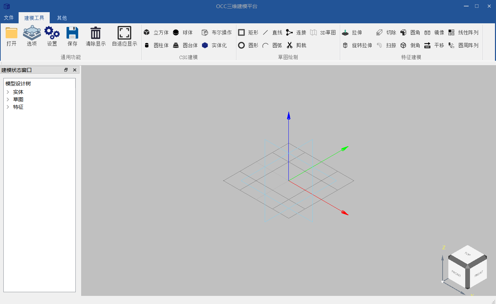
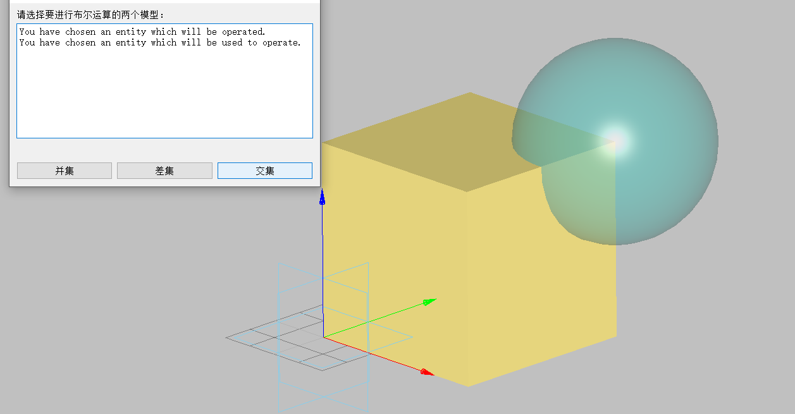

# ModelingSystem_Based_on_OpenCASCADE

A 3D modeling system based on OpenCASCADE and Qt, supporting CAD file reading, geometry creation, and feature operations.


## Project Overview

This project combines the OpenCASCADE geometric engine with the Qt framework to implement a lightweight 3D modeling system. It supports reading mainstream CAD file formats such as STEP/IGES, provides core functions including basic geometry creation (cubes, cylinders, cones, etc.), Boolean operations, and feature operations (extrusion, revolution, pattern, etc.), and realizes interactive operations through a Qt interface.


## Features

1. **File Operations**: Support reading STEP (.stp/.step) and IGES (.igs/.iges) format files
2. **Basic Geometry Creation**:
   - Cubes, cylinders, cones, spheres
   - 2D sketches (rectangles, circles) and 3D wireframes
3. **Boolean Operations**: Intersection, union, difference
4. **Feature Operations**:
   - Extrusion, revolution, sweeping
   - Fillet, chamfer
   - Mirroring, translation, circular pattern, linear pattern
5. **Interactive Interface**: Ribbon-style interface based on Qt and SARibbonBar, supporting parametric design


## Environment Requirements

- Operating System: Windows (based on VS compilation configuration)
- Dependent Libraries:
  - Qt 5.12+ (5.14.2 recommended)
  - OpenCASCADE (geometric engine)
  - CMake 3.5+ (build tool)
  - Visual Studio 2017+ (compilation environment)


## Compilation Steps

1. **Clone the Repository**
   ```bash
   git clone <repository URL>
   cd ModelingSystem_Based_on_OpenCASCADE
   ```

2. **Configure CMake**
   ```bash
   # Example: Using VS2017 and Qt5.14.2
   "C:\Program Files (x86)\cmake3.27.9\bin\cmake.exe" -B build -S . -G "Visual Studio 15 2017" -A x64 -DQt5_DIR="C:\Qt\Qt5.14.2\5.14.2\msvc2017_64\lib\cmake\Qt5"
   ```

3. **Build the Project**
   ```bash
   # Build Debug version
   "C:\Program Files (x86)\cmake3.27.9\bin\cmake.exe" --build build --target install --config Debug
   # Build Release version
   "C:\Program Files (x86)\cmake3.27.9\bin\cmake.exe" --build build --target install --config Release
   ```


## Usage Instructions

1. **Launch the Program**: Run the compiled executable file (located in the `bin_qt<version>_<compiler>_x64` directory)
2. **Load Models**: Click the interface button to select a STEP/IGES file, and the model will be displayed in the 3D view
3. **Create Geometry**:
   - Enter parameters in the corresponding function panel (e.g., CSG Cube Design)
   - Click the "OK" button to generate the geometry
4. **Feature Operations**: Select the created geometry, set parameters in the feature panel (e.g., extrusion height, pattern quantity), and apply the operation


## Project Structure

```
ModelingSystem_Based_on_OpenCASCADE/
├── QtOccApplication/          # Main application directory
│   ├── src/                  # Source code
│   │   ├── CSG/              # Constructive Solid Geometry implementation
│   │   ├── Stre/             # Sketch-related implementation
│   │   ├── Feature/          # Feature operation implementation
│   │   └── ...
│   ├── inc/                  # Header files
│   └── main.cpp              # Program entry
├── SARibbonBar_amalgamate/   # Third-party interface components
├── .gitignore                # Git ignore file configuration
└── README.md                 # Project description document
```


## Notes

- Ensure correct environment variable configuration for Qt and OpenCASCADE
- Modify the Qt directory in the CMake command according to the actual installation path during compilation
- Some functions may require specific versions of OpenCASCADE; it is recommended to use a newer stable version


## License

[Fill in according to the actual license of the project; leave blank or mark a general license such as MIT if not specified]
